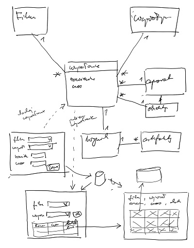
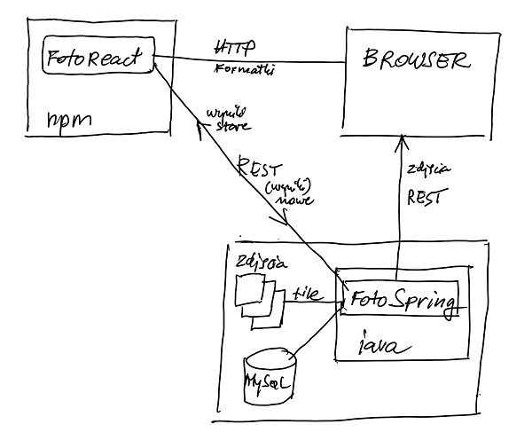
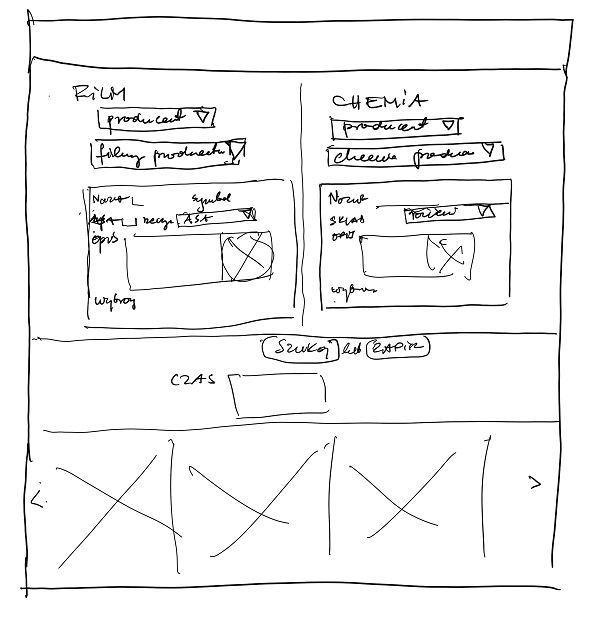
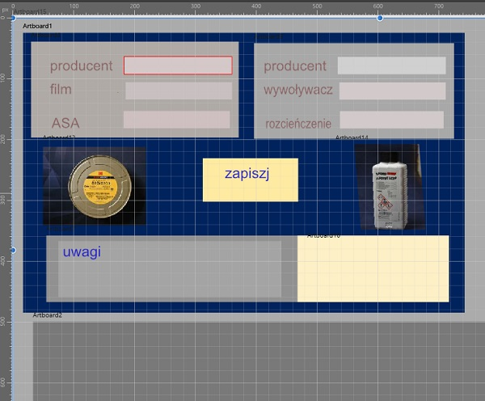

# Fotolab- REACT

Projekt testowy w celu sprawdzenia założeń (proof of concept)

## projekty powiązane
https://github.com/kot2017/fotospring

## Cel biznesowy
Sprawdzenie pomysłu na zarządzanie eksperymentami.
#### opis problemu
Podczas testowania róznych rodzajów filmów i wywoływaczy tworzona jest baza wiedzy, która obejmuje rózne kombinacje parametrów. Powstaje również dużo zdjęc, które muszą byc odpowiednio zarządzane. 
####podejście do rozwiązania
Zapisywanie w bazie danych kombinacji wywołań filmów, a towarzyszących im zdjęć w strukturze plików. Powiązanie ścieżki do plików zdjęć na poodstawie nazw parametrów.

 
 

## Architektura aplikacji
backend: SpringBoot + REST + MySQL + Hibernate

frontend: React + Redux + Route + MaterialUI

## Architektura informacji
#### odczyt danych
Użytkownik wybiera z rozwijanych list parametry filmow i wywoływaczy a system znajduje odpowiadający im czas wywołania oraz przykładowe zdjęcia.
#### wprowadzanie danych
Użytkownik wybiera z rozwijanych list parametry filmów i wywoływaczy i wprowadza czas wywołania, a nastepnie wysyła przykładowe zdjęcia.

#### Projekt frontendu
Stona wejściowa
Główna funkcja: wprowadzenie danych o wywołania filmu
Funkcje składowe:
1.	Wyświetlenie listy zasobów (filmy, wywoływacze)
2.	Wybranie z listy filmu i wywoływacza
3.	Wprowadzenie dodatkowych danych o wywołaniu
4.	Zapisanie wywołania w bazie

## moduły

`npm install redux --save`

`npm install react-redux --save`
 
` npm i redux-thunk --save-dev`

`npm i react-id-generator`

`npm install react-bootstrap bootstrap`

`npm install react-bootstrap-table-next --save`

`npm add react-select`

`npm install --save react-router-dom`

