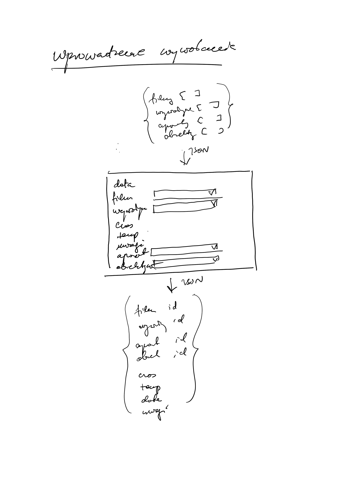

# Fotolab- REACT

Projekt testowy w celu sprawdzenia założeń (proof of concept)

##Cel biznesowy
Sprawdzenie pomysłu na zarządzanie eksperymentami

##Opis projektu

Projekt umozliwia zarządanie wywoływania filmów analogowych przy  róznych  kombinacjach filmu i wywoływacza.

usługa do zapisywania wywolań filmów
backend: SpringBoot + REST + MySQL + Hibernate
frontend: React + Redux + Route + MaterialUI

##Architektura

####Projekt frontendu
Stona wejściowa
Główna funkcja: wprowadzenie danych o wywołania filmu
Funkcje składowe:
1.	Wyświetlenie listy zasobów (filmy, wywoływacze)
2.	Wybranie z listy filmu i wywoływacza
3.	Wprowadzenie dodatkowych danych o wywołaniu
4.	Zapisanie wywołania w bazie

## moduły

`npm install redux --save`

`npm install react-redux --save`
 
` npm i redux-thunk --save-dev`

`npm i react-id-generator`

`npm install react-bootstrap bootstrap`

`npm install react-bootstrap-table-next --save`

`npm add react-select`

`npm install --save react-router-dom`

